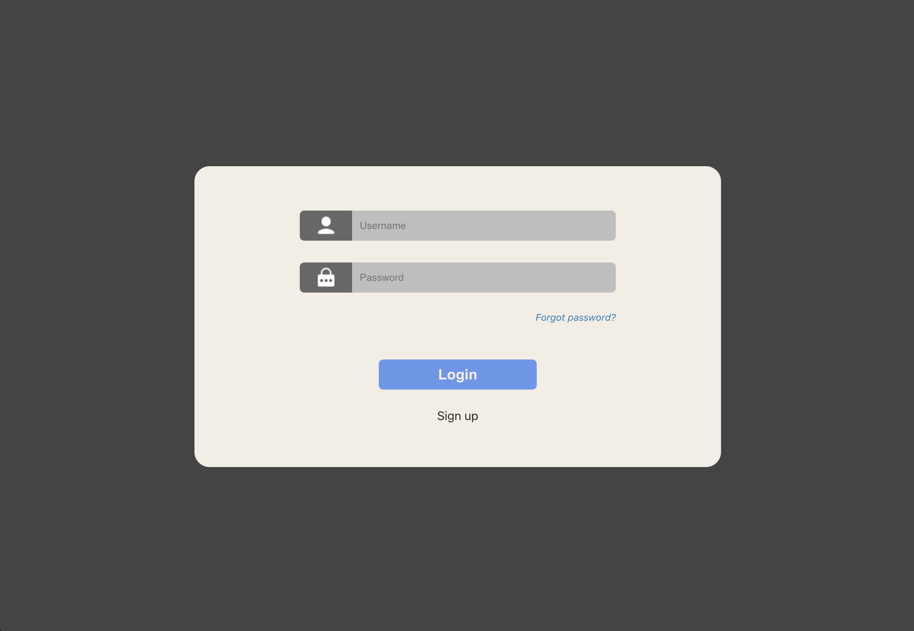
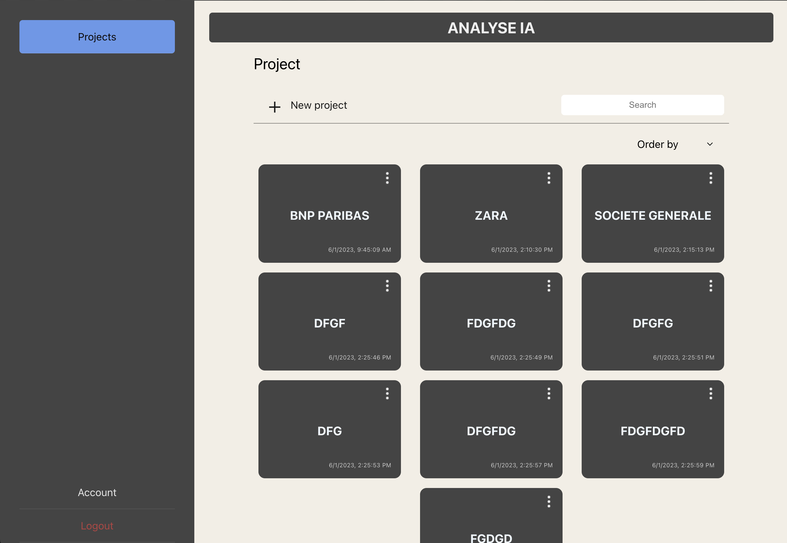
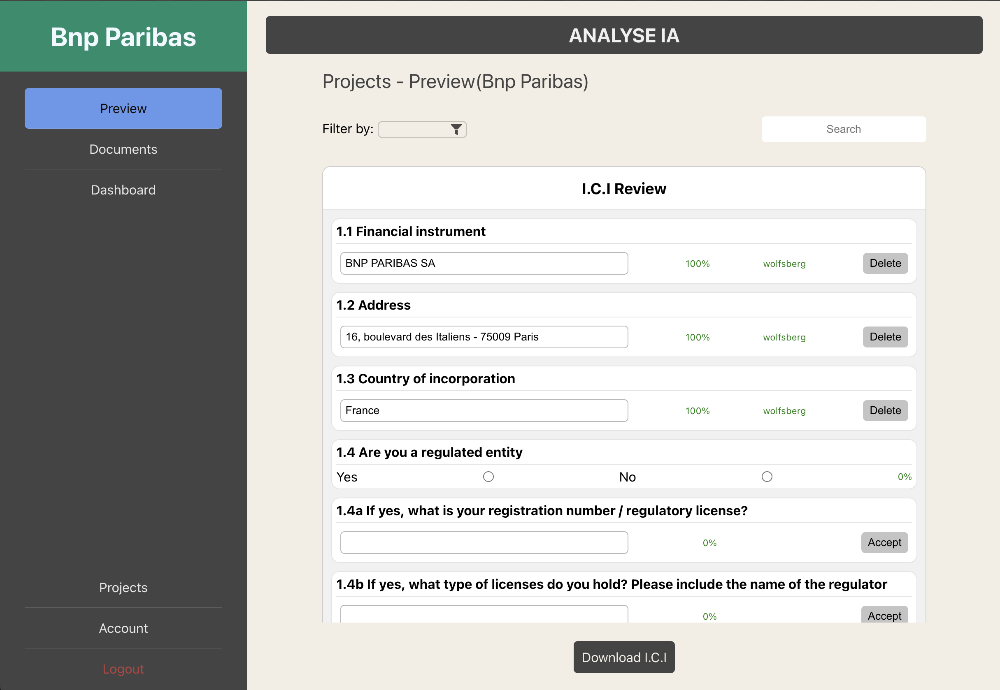
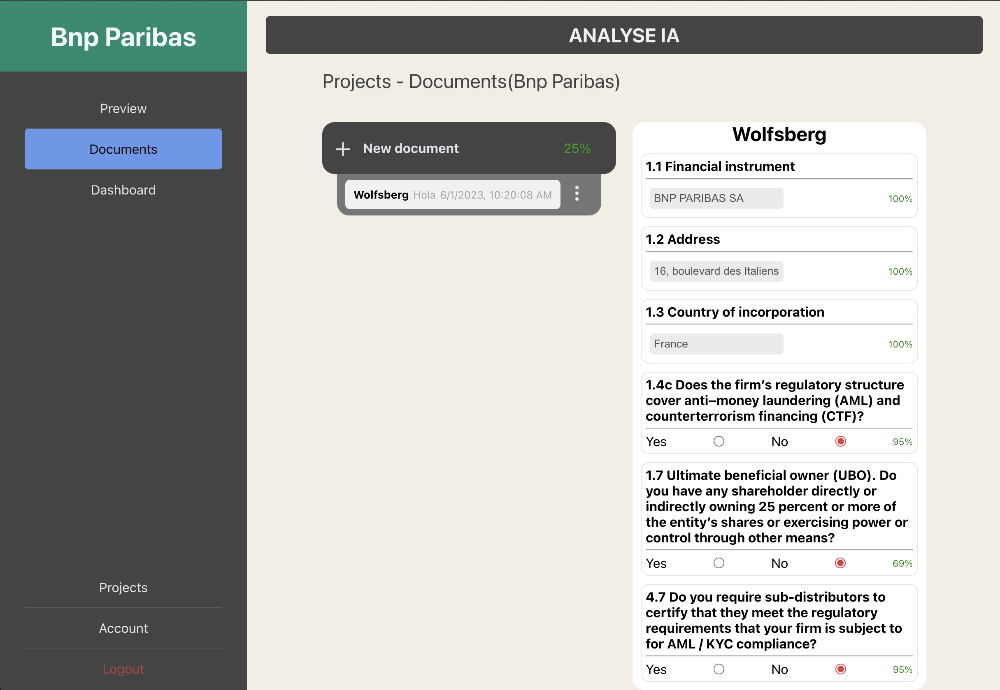
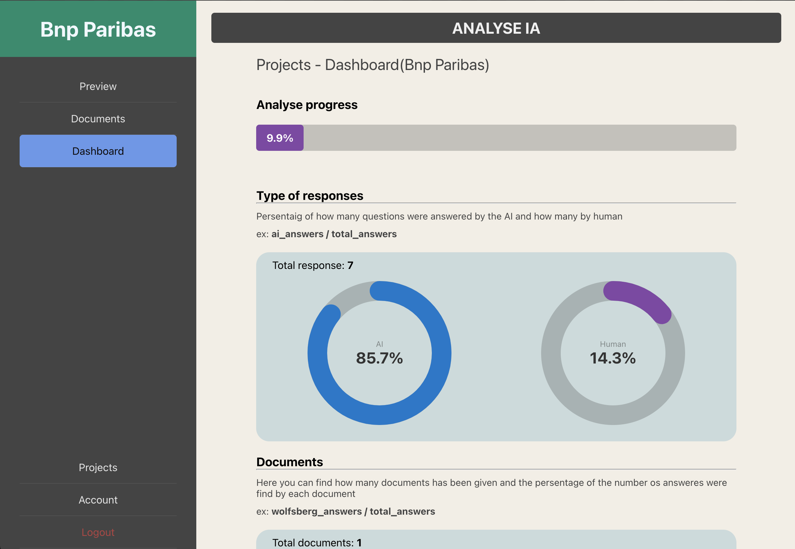

<h1 align="center">Analyse Financial Documents with AI</h1>

<p>In the business world, saving time is a primary advantage, so AI can be our best ally.
In this project, the main task is to perform a Due Deligence with only the insertion of business documents such as: Wolfsbrg, ESMA, SIRENE, KBIS</p>
<p>To achieve this we have developed an application whose objective is to automate this analysis</p>

<h2>STACKS</h2>

[](https://skills.thijs.gg)


<h2>TO RUN THE PROJECT</h2>
<h3>Follow the next steps:</h3>
<p>1- Create a database in your SGBD</p>
<p>2- Insert your acces information to the database</p>

```shell
  backend/server/server/settings.py
```
```py
  DATABASES = {
      'default': {
          'ENGINE': 'django.db.backends.mysql',
          'HOST': 'localhost',
          'PORT': '3306',
          'USER': 'your_user_here',
          'PASSWORD': 'your_password_here',
          'NAME': 'your_data_base_name_here(django_api)',
          'OPTIONS': {
              'init_command': "SET sql_mode='STRICT_TRANS_TABLES'"
          }
      }
  }
```

<p>3- Create the virtual envirement and install dependencies</p>

```shell
  backend$ pip install -r requirements.txt
```

<p>4- Create the migrations</p>

```shell
  backend/server$ python3 manage.py makemigrations
  backend/server$ python3 manage.py migrate
```

<p>5- Run the server</p>

```shell
  backend/server$ python3 manage.py runserver
```

<p>6- Initialize the FrontEnd</p>

```shell
  client$ npm install
```

<p>7- Run the FrontEnd server</p>

```shell
  client$ npm run start
```

<h6><i>Go to http://localhost:3000</i></h6>



<h3>Home</h3>

<h3>Preview</h3>

<h3>Documents</h3>

<h3>Dashboard</h3>



